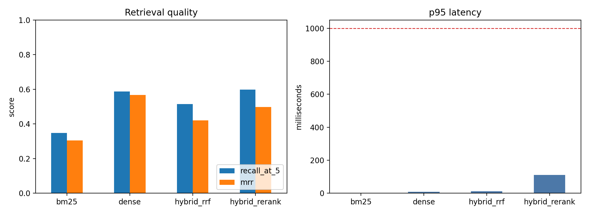

# Salesforce CRM Operations Retrieval Benchmark

Comparison of retrieval configurations (BM25 vs Dense vs Hybrid vs Reranker) on public Salesforce Service Cloud, Sales Cloud, Marketing Cloud, and Developer documentation.

# Why I Picked This Assignment

I chose this assignment because it is closely related to my previous experience operating and developing Salesforce-based CRM systems. At the time, Salesforce was a relatively new platform within the team, so we frequently relied on official documentation for feature implementation, configuration changes, troubleshooting, and new business requirements.

In a real CRM environment, finding the right information quickly is critical. Salesforce documentation is extensive and spans many areas, including Sales Cloud, Service Cloud, Marketing Cloud, Apex, Flow, and Security. Users also do not always search using official Salesforce terminology. They often describe business problems, operational issues, or desired outcomes in natural language.

Because of this, I wanted to evaluate how different retrieval approaches perform in a realistic CRM documentation search scenario. The goal was to compare whether different retrieval methods could handle both exact technical terminology and the natural language queries that arise during day-to-day CRM operations.

# Decisions I Made

## 1. Creating Queries from Multiple User Perspectives

The queries were inspired by real Salesforce CRM operational scenarios I had seen or handled across different user roles. This helped make the benchmark closer to how users actually search documentation in practice.

The user groups included:

- CRM administrators and developers
- Sales users
- Call center agents
- Marketing users

For example, developers are more likely to search for technical topics such as Apex Triggers or Governor Limits, while sales users may search for Opportunity or Quote management. Call center agents are more likely to look for documentation related to Email-to-Case, case management, or access issues.

Because Salesforce is used by many different roles within an organization, I believed that including queries from multiple perspectives would create a more realistic retrieval benchmark.

For each query, I manually checked the selected Salesforce PDF corpus and labelled the chunk or chunks that directly answered the question.

## 2. Varying Query Difficulty

Some queries directly include official Salesforce terminology such as Email-to-Case or Governor Limits.

For harder queries, I described business scenarios and symptoms instead of naming the target feature directly. Examples include situations where an automation fails only for certain users or where a process breaks when handling large volumes of records.

This approach allows the evaluation to measure not only keyword matching performance but also the ability to retrieve relevant documentation from natural language descriptions.

## 3. Using PDF Documentation as the Corpus

I initially considered collecting Salesforce documentation directly from the web.

However, Salesforce documentation relies heavily on JavaScript-based dynamic rendering, which makes reliable collection more difficult. Since reproducibility was an important requirement for this assignment, I chose publicly available PDF documentation as the corpus so that the dataset could be recreated consistently on another machine.


# Corpus

The default corpus build currently writes 344 retrieval documents extracted
from public Salesforce PDF documentation related to customer support
workflows, account and contract-related records, customer communication
processes, and CRM automation. Long PDF pages and selected continuous sections
are split into focused retrieval documents so that the system retrieves
specific documentation passages rather than entire guides.

Salesforce CRM operations documentation is a good benchmark corpus because it
contains both exact product terminology and operational questions that users
often phrase indirectly. That makes it useful for comparing lexical retrieval,
dense retrieval, hybrid retrieval, and reranking.

Raw PDF source URLs are tracked in `data/raw/source_urls.txt`.
`src/build_corpus.py` downloads those PDFs into an ignored local cache, extracts
page text, filters CRM-operations-related chunks, and writes
`data/processed/documents.jsonl`.


# Retrieval Configurations

The benchmark evaluates four configurations on the same documents and queries:

- `bm25`: lexical BM25 retrieval.
- `dense`: dense retrieval with a SentenceTransformers embedding model.
- `hybrid_rrf`: reciprocal-rank-fusion blend of BM25 and dense retrieval.
- `hybrid_rerank`: hybrid RRF candidate generation followed by a CrossEncoder
  reranker over the top 20 candidates.

# Metrics

The evaluation reports:

- `recall@5`
- `MRR`
- `p95_latency_ms`

Latency is measured after indexes and embedding models are loaded. The target is
p95 retrieval latency under 1 second on a single laptop or free-tier VM.
Each query has between 1 and 5 labelled relevant documents. Recall@5 is computed as fractional document-level recall: the number of labelled relevant documents retrieved in the top 5 divided by the total number of labelled relevant documents for that query.

# Results

## Overall Analysis

The benchmark was run on 344 retrieval documents and 20 labelled queries,
including 5 hard queries.

| config | recall@5 | MRR | p95 latency |
| --- | ---: | ---: | ---: |
| bm25 | 0.347 | 0.304 | 1.7 ms |
| dense | 0.588 | 0.567 | 10.0 ms |
| hybrid_rrf | 0.514 | 0.421 | 9.8 ms |
| hybrid_rerank | 0.598 | 0.497 | 83.1 ms |



I choose dense retrieval as the best practical configuration for this corpus.
Hybrid reranking has the highest recall@5 by a narrow margin, but dense has the
highest MRR, nearly the same recall@5, and much lower p95 latency. BM25 is the
fastest baseline, but it misses more paraphrased and cross-guide queries. Plain
hybrid RRF improves over BM25 but does not beat dense-only retrieval on this
corpus.

All configurations meet the p95 latency constraint. The reported latency
excludes corpus construction and dense embedding generation, and measures
retrieval after indexes and models are loaded.

## Category Analysis

Average recall@5 by retrieval category:

| category | bm25 | dense | hybrid_rrf | hybrid_rerank |
| --- | ---: | ---: | ---: | ---: |
| `natural_language_task_description` | 0.625 | 0.708 | 0.792 | 0.792 |
| `exact_product_feature_lookup` | 0.333 | 0.750 | 0.583 | 0.750 |
| `paraphrased_feature_discovery` | 0.250 | 0.500 | 0.333 | 0.417 |
| `symptom_based_troubleshooting` | 0.000 | 0.333 | 0.167 | 0.278 |
| `cross_object_or_cross_system_workflow` | 0.200 | 0.000 | 0.200 | 0.200 |

The category-level results show that hybrid reranking had the highest macro-average Recall@5 across retrieval categories, with an average score of 0.487, compared with 0.458 for dense retrieval, 0.415 for hybrid RRF, and 0.282 for BM25. However, dense retrieval remains the best practical choice overall because its overall MRR is higher, its overall recall is nearly tied with hybrid reranking, and its latency is much lower.

BM25 was weaker because many queries were written in natural business language instead of exact Salesforce documentation terms. Dense retrieval handled these queries better, especially in natural-language task descriptions, exact product feature lookup, symptom-based troubleshooting, and paraphrased feature discovery.

Hybrid reranking matched or improved dense retrieval in some categories, especially exact product feature lookup and cross-object or cross-system workflows. However, the improvement was small compared with the added latency and complexity. For this benchmark, dense retrieval provided the best balance between retrieval quality, speed, and implementation simplicity.

The cross-object category is now a one-query slice after revising the query labels, so I treat it as diagnostic rather than a stable category-level conclusion. The broader weak areas are symptom-based troubleshooting and paraphrased feature discovery, where users describe an issue or requirement without naming the target Salesforce feature directly.

## Hard Queries

The five deliberately hard queries are q12, q16, q17, q19, and q20. These queries were designed to avoid direct target-feature lookup. Instead, they describe cross-object automation, paraphrased feature discovery, or symptom-based troubleshooting scenarios.


| query | category | query text | related area |
| --- | --- | --- | --- |
| q12 | `cross_object_or_cross_system_workflow` | How do I add logic so that when a Case is created or updated, a field on the related Account is also updated? | Case-to-Account automation with Apex triggers and record-triggered Flow |
| q16 | `paraphrased_feature_discovery` | How can a marketer identify customers who neither opened nor clicked a voucher email in Journey Builder before sending a follow-up mobile message? | Journey Builder email engagement branching followed by mobile messaging |
| q17 | `paraphrased_feature_discovery` | A guided process creates an Opportunity with related records. How can an admin test input combinations, observe the execution path, and prevent test records from being saved? | Flow Builder debugging, input testing, and rollback behavior |
| q19 | `symptom_based_troubleshooting` | A Case automation works for a few records but fails when many Cases are updated at once. How should I investigate and redesign it for large batches? | Bulk Case automation failure, trigger bulkification, SOQL limits, and governor limits |
| q20 | `symptom_based_troubleshooting` | A user can open Account records but the Edit option is unavailable for some customer accounts. What access settings should I investigate? | Record-level access, sharing calculation, and edit access troubleshooting |

| config | hard recall@5 | hard MRR | complete misses |
| --- | ---: | ---: | --- |
| bm25 | 0.040 | 0.067 | q16, q17, q19, q20 |
| dense | 0.400 | 0.500 | q12, q19 |
| hybrid_rrf | 0.207 | 0.233 | q16, q19 |
| hybrid_rerank | 0.207 | 0.350 | q17, q19 |

Dense retrieval performed best on the hard-query subset, with the highest hard-query Recall@5 and MRR. This suggests that semantic matching was more effective than lexical matching when the query described an operational problem without naming the target Salesforce feature directly.

Hybrid reranking did not outperform dense retrieval on aggregate hard-query scores. It recovered different hard cases than dense retrieval, but it did not consistently rank relevant chunks higher than dense retrieval, which explains its lower MRR.

The hardest case was q19, which every configuration missed. It requires recognizing a bulk-processing failure pattern and linking it to Apex trigger bulkification and governor limits. This failure shows that symptom-based troubleshooting remains the clearest area where the best practical configuration still loses.
## Dense Failure Analysis

Dense retrieval completely missed five queries: q09, q12, q13, q15, and q19. These misses were useful because they show where semantic retrieval still breaks down in Salesforce documentation search.

| query | failure pattern | explanation |
| --- | --- | --- |
| q09 | Ambiguous Salesforce term | The query asks whether the `Profile` object can be updated in Apex. Dense retrieval matched the word `Profile` to security and permission documentation instead of the Apex documentation about sObjects that do not support DML operations. |
| q12 | Cross-object automation | The query describes updating an Account when a related Case is created or updated. Dense retrieval returned nearby Flow and Email-to-Case pages, but missed the more specific Apex trigger and record-triggered Flow passages. |
| q13 | Cross-system feature discovery | The query asks how to use Salesforce CRM data in Marketing Cloud for messaging. The relevant documentation uses more specific terms such as `Synchronized Data Sources`, `Synchronized Data Extensions`, `Contact Builder`, and `Marketing Cloud Connect`, which were not present in the query. |
| q15 | Permission and layout ambiguity | The symptom sounds like a page layout issue because the field does not appear on the Account record page. The labelled answer is actually about field-level security and field permissions, so dense retrieval returned adjacent setup and access-control pages. |
| q19 | Symptom-based troubleshooting | The query describes an automation that works for a few Case records but fails in bulk. Dense retrieval did not connect this symptom to Apex bulk trigger patterns, SOQL limits, and governor limits. |

The clearest failure case was q19, which every retrieval configuration missed. This query does not use the developer terms that appear in the labelled documentation. It describes the operational symptom instead: the automation works for a few records but fails when many records are updated at once. This shows that symptom-based troubleshooting remains the weakest area of the benchmark.


# If I Had One More Week

If I had one more week, I would improve both the corpus construction and the evaluation set.

For corpus construction, I would add more document context to each retrieval chunk. The current corpus contains 344 mostly text-based chunks, but Salesforce PDFs often depend on guide titles, section headings, tables, setup steps, diagrams, and screenshots. Without this context, chunks containing terms such as `routing address`, `debug options`, or `field permissions` can be difficult to distinguish across Email-to-Case, Flow Debug, and Field-Level Security documentation. I would therefore prepend guide titles and section headings to chunks, preserve table and step-by-step structures, generate short descriptions for visual content, and store parent document metadata. I would also test grouping results from the same page or section.

For evaluation, I would expand the 20-query benchmark, especially in the hardest categories: cross-object or cross-system workflows, symptom-based troubleshooting, and paraphrased feature discovery. I would also inspect hard misses to see whether they are caused by poor chunk boundaries, missing section context, ambiguous labels, or model limitations. This would make the benchmark more representative of real Salesforce documentation search, where users often describe their goal or problem without knowing the exact Salesforce feature name.

# Reproduce

Install dependencies:

```bash
pip install -r requirements.txt
```

Reproduce the reported benchmark results from the checked-in processed corpus:

```bash
make run
```

If `make` is not available on Windows, use the equivalent PowerShell command:

```powershell
powershell -ExecutionPolicy Bypass -File scripts/run.ps1
```

Both commands write `results/metrics.csv`, `results/per_query_results.csv`, and
`results/metrics_plot.png`.

To rebuild the processed corpus from the raw source list before evaluation, run:

```bash
make build-corpus
make inspect
make run
```
